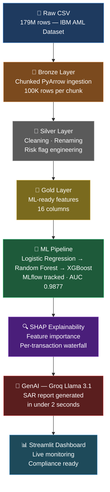

# 🏦 AML Transaction Monitoring System


> Enterprise-grade Anti-Money Laundering detection system processing **179 million banking transactions** using Machine Learning, SHAP Explainability, and Generative AI.

---

## 📌 Table of Contents

- [Project Overview](#-project-overview)
- [Architecture](#%EF%B8%8F-architecture)
- [Model Results](#-model-results)
- [Key Features](#-key-features)
- [Tech Stack](#%EF%B8%8F-tech-stack)
- [CI/CD Strategy](#%EF%B8%8F-cicd-strategy)
- [Project Structure](#-project-structure)
- [How to Run](#-how-to-run)
- [Author](#-author)

---

## 🎯 Project Overview

A production-ready AML transaction monitoring system that:

- Processes **179 million** banking transactions through a Medallion architecture pipeline
- Trains and compares **3 ML models** tracked via MLflow
- Achieves **AUC-ROC of 0.9877** using XGBoost
- Explains every prediction using **SHAP** for regulatory compliance
- Generates professional **SAR reports in under 2 seconds** using Groq Llama 3.1
- Delivers a live **Streamlit dashboard** for compliance teams
- Runs a full **DEV → UAT → MAIN** automated CI/CD pipeline

---

## 🏗️ Architecture


---

## 📊 Model Results

| Model | Precision | Recall | F1 Score | AUC-ROC |
|---|---|---|---|---|
| Logistic Regression | 0.0008 | 0.5714 | 0.0016 | 0.9322 |
| Random Forest | 0.1154 | 0.4286 | 0.1818 | 0.8544 |
| **XGBoost ✅** | **0.0256** | **0.4286** | **0.0484** | **0.9877** |

> **Winner: XGBoost** — Highest AUC-ROC (0.9877) — selected as production model

---

## ✨ Key Features

- **Memory-safe ingestion** — 179M rows without overflow using PyArrow chunking
- **Class imbalance handling** — SMOTE + scale_pos_weight=14285
- **MLflow experiment tracking** — all 3 models compared side by side
- **SHAP explainability** — regulatory compliance ready
- **GenAI SAR generation** — 60-minute manual task done in 2 seconds
- **Streamlit dashboard** — 3-page live monitoring system
- **Enterprise CI/CD** — GitHub Actions on DEV, UAT, MAIN branches

---

## 🛠️ Tech Stack

| Category | Technology |
|---|---|
| Language | Python 3.10 |
| Data Processing | PyArrow, Pandas |
| ML Models | Scikit-learn, XGBoost |
| Imbalance Handling | SMOTE (imbalanced-learn) |
| Experiment Tracking | MLflow |
| Explainability | SHAP |
| GenAI | Groq (Llama 3.1) |
| Dashboard | Streamlit |
| CI/CD | GitHub Actions |
| Architecture | Medallion (Bronze/Silver/Gold) |

---

## ⚙️ CI/CD Strategy

```mermaid
flowchart LR
    A[👨‍💻 Developer\ngit push dev] --> B

    B[🔵 DEV Branch\nci_dev.yml] --> B1[✅ Syntax check\nModels + Pipeline]
    B1 -->|auto merge| C

    C[🟡 UAT Branch\nci_uat.yml] --> C1[✅ Full validation\nAll modules + DQ + GenAI]
    C1 -->|auto merge| D

    D[🟢 MAIN Branch\nci_main.yml] --> D1[✅ Production gate\nAll + Streamlit dashboard]

    style A fill:#1e3a5f,color:#ffffff,stroke:#4a90d9
    style B fill:#1e4a7a,color:#ffffff,stroke:#3a7ac4
    style B1 fill:#1e5a3a,color:#ffffff,stroke:#3ac47a
    style C fill:#5a4a1e,color:#ffffff,stroke:#c4943a
    style C1 fill:#1e5a3a,color:#ffffff,stroke:#3ac47a
    style D fill:#1e5a1e,color:#ffffff,stroke:#3ac43a
    style D1 fill:#1e5a3a,color:#ffffff,stroke:#3ac47a
```



### How It Works

| Branch | Pipeline | Checks | On Success |
|---|---|---|---|
| dev | ci_dev.yml | Syntax check — models + pipeline | Auto merge → UAT |
| uat | ci_uat.yml | Full validation — all modules | Auto merge → MAIN |
| main | ci_main.yml | Production gate — all + Streamlit | Pipeline complete ✅ |

> **One push to dev triggers the entire pipeline automatically.**
> No manual merging required — code flows from DEV → UAT → MAIN on its own.
```
## 📁 Project Structure

```
aml-transaction-monitoring/
│
├── src/                          # All source code
│   ├── ingestion/                # 🥉 Bronze — PyArrow chunked ingestion
│   ├── features/                 # 🥈🥇 Silver + Gold feature engineering
│   ├── models/                   # 🤖 LR, Random Forest, XGBoost + MLflow
│   ├── evaluation/               # 🔍 SHAP explainability
│   ├── dq/                       # ✅ Data quality validation
│   └── genai/                    # 🧠 SAR report generation
│
├── streamlit_app/                # 📊 Live dashboard
│   └── pages/                    # 3 monitoring pages
│
├── notebooks/                    # 📓 EDA — 10 key findings
├── reports/                      # 📈 SHAP charts
├── artifacts/                    # 💾 Trained model pkl files
├── docs/                         # 📄 BRD, model card, technical design
└── .github/workflows/            # ⚙️ CI/CD — DEV UAT MAIN pipelines
```

---

## 🚀 How to Run

```bash
# Clone repository
git clone https://github.com/dirumisra/aml-transaction-monitoring.git
cd aml-transaction-monitoring

# Create virtual environment
python -m venv venv
source venv/Scripts/activate  # Windows
source venv/bin/activate       # Mac/Linux

# Install dependencies
pip install -r requirements.txt

# Add API key
cp .env.example .env
# Edit .env and add your GROQ_API_KEY

# Run data pipeline
python src/ingestion/bronze_aml_ingest.py
python src/features/silver_aml_transform.py
python src/features/gold_feature_engineering.py

# Train best model
python src/models/model_xgboost.py

# Launch dashboard
streamlit run streamlit_app/app.py
```

---

## 👨‍💻 Author

**Dhiraj Mishra** — Data & AI Engineer

[](https://www.linkedin.com/in/dirumisra/)
[](https://github.com/dirumisra)

[](https://dirumisra-aml-transaction-monitoring-streamlit-appapp-0jbobc.streamlit.app)

*Built as an enterprise-grade portfolio project demonstrating end-to-end ML engineering capabilities.*

---

## 🙏 Acknowledgements

This project was built with dedication and a commitment to deep understanding — every line of code typed manually, every concept understood before implementation.

Special thanks to the learning process that made this possible — from Bronze layer ingestion to GenAI SAR generation, every step was a lesson in enterprise ML engineering.

> *"The best way to learn is to build something real."*

If you found this project useful or inspiring, feel free to ⭐ star the repository and connect on [LinkedIn](https://www.linkedin.com/in/dirumisra/).

---

*Built with ❤️ by Dhiraj Mishra — April 2026*